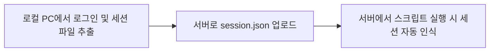

# 인스타그램 세션 동기화 가이드 (session.json 생성 및 적용)

리눅스 서버(상업용 클라우드 VPS) 환경에서는 인스타그램의 강한 봇 탐지 정책 때문에 비로그인 상태의 크롤링이 차단될 수 있습니다. 이를 해결하기 위해 **로컬 PC에서 로그인 상태를 저장한 세션 파일(`session.json`)을 생성해 서버로 전송**하는 방법을 안내합니다.

---

## 📋 요약 흐름


---

## 🛠️ 상세 단계

### 1단계: 로컬 PC(윈도우/맥)에서 세션 파일 생성하기

로컬 PC(화면과 웹 브라우저가 직접 열리는 컴퓨터)에서 실행합니다.

1. **로컬 프로젝트 폴더로 이동 및 패키지 설치**
   터미널(또는 명령 프롬프트)을 열고 프로젝트 폴더로 이동하여 Playwright 브라우저를 다운로드합니다:
   ```bash
   # 의존성 패키지 설치
   npm install
   
   # 브라우저 설치 (이미 설치되어 있다면 스킵 가능)
   npx playwright install chromium
   ```

2. **로그인 창 띄우기 & 로그인하기**
   다음 명령어를 실행하여 크롬 브라우저를 띄우고 로그인을 수행합니다:
   ```bash
   npx playwright codegen https://www.instagram.com --save-storage=session.json
   ```
   * **무슨 일이 일어나나요?**:
     - 자동으로 브라우저 창이 열리고 인스타그램 로그인 화면으로 이동합니다.
     - **인스타그램 계정으로 로그인**을 완료합니다. (보안 코드나 2단계 인증 요구 시 직접 입력합니다.)
     - 피드 화면이 정상적으로 나오면 **브라우저 창을 닫습니다.**
     - 브라우저를 종료하면 프로젝트 폴더 루트에 `session.json` 파일이 자동으로 생성됩니다.

---

### 2단계: 리눅스 서버에 `session.json` 전송하기

생성된 `session.json` 파일을 리눅스 서버의 프로젝트 경로(`~/instagram-memu-crawler/`)에 업로드합니다.

* **SCP 명령어를 사용하는 경우 (예시):**
  ```bash
  # 로컬 PC 터미널에서 실행
  scp session.json ubuntu@instance-20250419-2153:~/instagram-memu-crawler/
  ```
  *(또는 FileZilla, WinSCP 등 편한 FTP 툴을 이용하여 서버의 `~/instagram-memu-crawler` 디렉토리에 넣어주셔도 됩니다.)*

---

### 3단계: 서버 실행 및 주기적 동기화

서버에 세션 파일이 업로드되면 이제 크롤러가 로그인 장벽 없이 동작합니다.

* **동작 확인용 일회성 실행 (서버 터미널):**
  ```bash
  node find_menu_images.js jnjskybiz --count 5
  ```
  *스크립트 실행 시 자동으로 폴더 내의 `session.json` 파일을 감지하고 `🔑 Loading session state...` 라는 안내가 출력됩니다.*

---

## ⚠️ 주의 및 팁 (FAQ)

1. **로그인이 언제 만료되나요?**
   - 인스타그램은 보통 세션 만료 기간이 매우 깁니다(수개월 이상). 그러나 수동으로 인스타그램 사이트에서 "모든 기기에서 로그아웃"을 누르거나 비밀번호를 변경하면 세션이 강제 만료됩니다.
   - 만약 리눅스 서버 실행 로그에 다시 `❌ Failed to bypass login popup` 에러가 나기 시작하면 세션이 만료된 것이므로, **1단계부터 다시 수행하여 최신 `session.json`을 갱신**해 주시면 됩니다.
2. **보안 주의사항**
   - `session.json` 파일에는 사용자의 실제 로그인 상태(비밀번호 제외한 쿠키 값)가 담겨 있습니다. 이 파일이 외부에 공개되지 않도록 주의하십시오.
   - 프로젝트 내 `.gitignore` 파일에 `session.json`이 추가되어 있어 Git 저장소(Github 등)에 업로드되지 않도록 이미 조치해 두었습니다.
